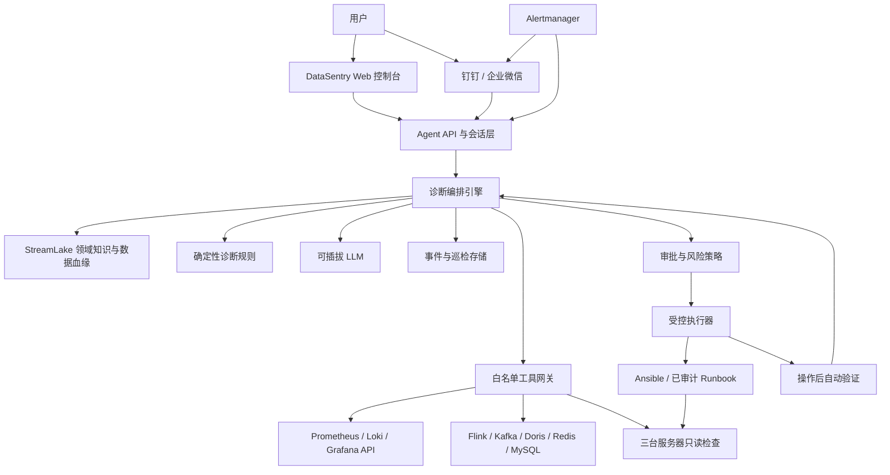
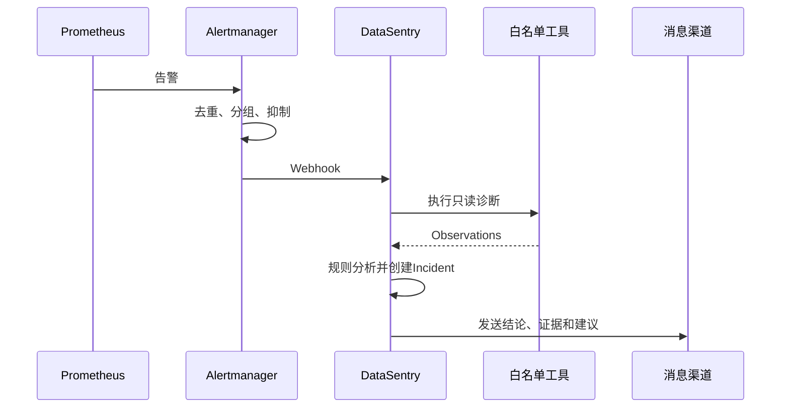
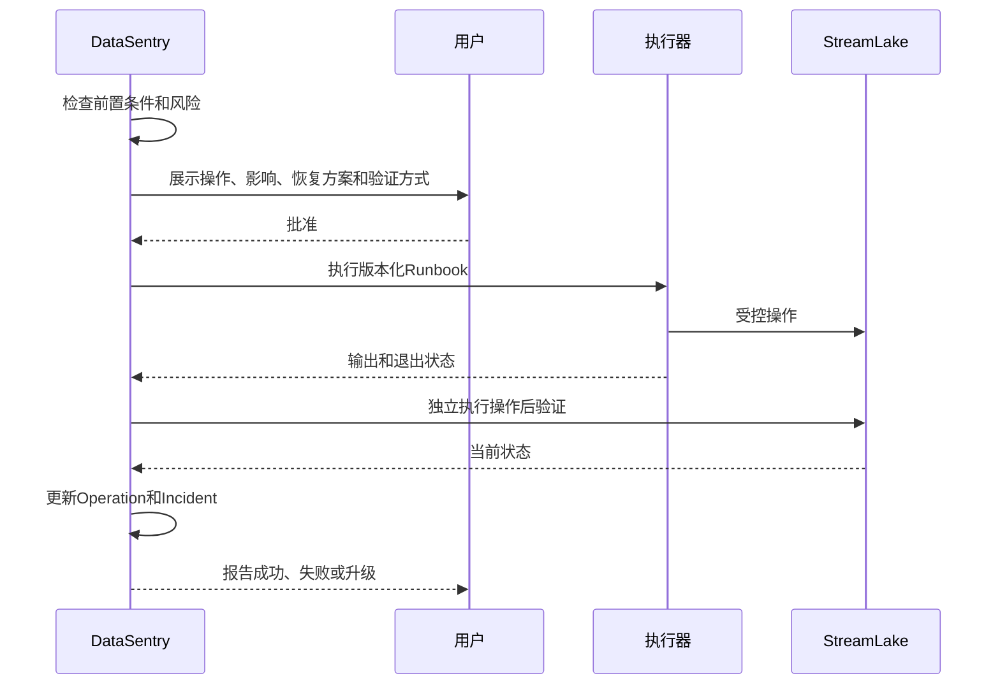

# DataSentry 总体架构与开发路线设计

## 1. 文档状态

- 项目：StreamLake-Binance 智能运维 Agent
- 产品名：DataSentry
- 日期：2026-06-25
- 状态：总体设计已完成初步确认，等待书面规格复核
- 适用范围：DataSentry 从最小可用诊断能力演进到有限自治运维的总体架构

## 2. 背景与目标

StreamLake-Binance 是由 Collector、Kafka、Flink、Doris、Redis、MySQL、Spring API 和 AI Engine 组成的实时数仓与风控系统。现有系统具备实时采集、计算和服务能力，但缺少统一可观测性、稳定告警、证据化故障诊断、事件记忆和安全自动修复。

DataSentry 的目标不是重新开发一套 Prometheus、Grafana 或告警平台，而是在成熟开源可观测性组件之上，构建理解 StreamLake 业务血缘和运维约束的专属 Agent。

最终产品应具备以下能力：

1. 通过可视化看板观察主机、组件、任务和业务数据新鲜度。
2. 发现异常后自动聚合告警、执行只读巡检并发送消息。
3. 用户能够通过自然语言询问系统状态、故障原因和处理建议。
4. 每个诊断结论均有来源、时间和证据状态，不把推测包装成事实。
5. 保存巡检、事故、根因、操作和验证结果，形成结构化运维记忆。
6. 在审批、审计、幂等、回退和验证约束下逐步开放自动修复。

## 3. 产品原则

### 3.1 复用成熟基础设施

- 指标采集、时序存储和告警规则使用 Prometheus 生态。
- 可视化使用 Grafana。
- 告警去重、分组、抑制和路由使用 Alertmanager。
- 集中日志在后续阶段使用 Loki 和 Grafana Alloy。
- 主机批量操作在后续阶段使用 Ansible 或经过审计的参数化 Runbook。

DataSentry 不重复开发通用图表引擎、时序数据库、日志存储或通知路由。

### 3.2 自研领域智能

DataSentry 的核心价值集中在：

- StreamLake 组件拓扑和数据血缘。
- 面向 Kafka、Flink、Doris 和 Redis 的诊断路径。
- 历史知识、实时状态和推断之间的证据分级。
- 面向生产运维的权限、审批和安全执行。
- 事故生命周期、历史经验和操作后验证。

### 3.3 确定性优先

- 组件状态、阈值判断、权限和操作约束由确定性代码完成。
- LLM 用于理解用户意图、辅助规划查询和组织自然语言回答。
- LLM 不能直接生成并执行任意 Shell，不能决定绕过审批，也不能把未知信息改写为确定事实。
- 关键诊断即使暂时没有 LLM，也应能够以规则和状态机运行。

### 3.4 渐进自治

开发顺序必须遵循：

```text
可靠诊断
→ 真实只读巡检
→ 可观测性与告警
→ 对话与Web体验
→ 事件记忆
→ 审批式修复
→ 有限自治
```

在系统尚不能稳定发现和解释问题之前，不开放自动修复。

## 4. 方案选择

### 4.1 备选方案

| 方案 | 优点 | 缺点 | 结论 |
|---|---|---|---|
| 商业 AIOps 平台 | 上线快、功能完整 | 需要持续付费，领域定制和数据控制受限 | 不采用 |
| 全部自研 | 控制力强 | 重复开发监控、看板、日志和通知基础设施 | 不采用 |
| 开源底座 + 自研领域 Agent | 零许可成本、可控、具有项目和简历价值 | 需要自行集成和维护 | 采用 |

### 4.2 选定方案

采用以下组合：

```text
Prometheus + Exporters       指标采集和规则计算
Grafana                      可视化看板
Alertmanager                 告警编排和消息通知
Loki + Alloy                 集中日志，后续接入
DataSentry                   对话、诊断、决策和事件记忆
Ansible / 参数化 Runbook     审批式运维执行，后续接入
SQLite → PostgreSQL          事件、巡检和操作数据
```

Alertmanager 官方能力包括告警去重、分组、路由、静默和抑制；Grafana OSS 可通过钉钉、企业微信、Slack、Telegram、电子邮件和通用 Webhook 等联系点发送通知。因此 DataSentry 只负责生成有业务上下文的诊断和事件，不自己重写通知系统。

参考：

- [Prometheus Alertmanager](https://prometheus.io/docs/alerting/latest/alertmanager/)
- [Grafana Alerting contact points](https://grafana.com/docs/grafana/latest/alerting/fundamentals/notifications/contact-points/)
- [Grafana Loki](https://grafana.com/docs/loki/latest/)
- [Ansible introduction](https://docs.ansible.com/projects/ansible/latest/getting_started/introduction.html)

## 5. 总体架构



## 6. 模块职责

### 6.1 Web 控制台

职责：

- 提供聊天入口。
- 展示系统健康概览、活跃告警、Incident 和操作审批。
- 展示诊断结论、证据、推断和未知项。
- 展示工具调用过程，但隐藏秘密和敏感参数。
- 嵌入或跳转 Grafana 看板。

Web 控制台不直接连接生产组件，所有查询和操作都经过 DataSentry API。

### 6.2 Agent API 与会话层

职责：

- 提供聊天、巡检、事件、审批和历史查询 API。
- 管理会话上下文和请求身份。
- 接收 Alertmanager Webhook。
- 将同步请求转化为可追踪的诊断任务。
- 通过 Server-Sent Events 或 WebSocket 推送诊断进度。

首版建议使用 FastAPI，既能复用 Python 运维生态，也便于集成异步工具和 LLM。

### 6.3 诊断编排引擎

职责：

1. 识别用户问题或告警类型。
2. 从知识索引选择相关主题。
3. 构建涉及的组件和数据链路。
4. 根据诊断策略选择白名单工具。
5. 汇总观察结果并运行确定性规则。
6. 生成 Finding、未知项和下一步建议。
7. 保存完整巡检记录。

编排引擎应与具体 LLM SDK 解耦，使规则测试和无模型运行成为可能。

### 6.4 领域知识与数据血缘

稳定知识包括：

- 组件和部署位置。
- Topic、Job、表和 Redis Key 之间的血缘。
- 配置优先级和恢复语义。
- 已知允许降级，例如 Milvus 未运行。
- 运维脚本和权限边界。

历史运行快照不属于稳定知识。实时状态只能来自现场工具，历史快照必须标记时间和 `historical` 状态。

第一阶段使用当前 Markdown 知识库和显式路由，不使用向量数据库。只有当文档规模和检索需求证明结构化路由不足时，才评估 RAG。

### 6.5 确定性诊断规则

规则负责将 Observation 转换为 Finding。例如：

```text
Kafka原始Topic持续推进
+ Kline Job不存在或非RUNNING
+ Doris K线业务时间停止推进
→ K线链路停在Flink计算层
```

规则必须可单元测试，并明确输入、结论、严重级别和所需证据。证据不足时只能输出 `inferred` 或 `unknown`。

### 6.6 可插拔 LLM

LLM 适合：

- 用户意图分类。
- 将自然语言参数映射到已定义工具。
- 对多条证据进行可读总结。
- 生成复盘初稿。

LLM 不负责：

- 决定用户是否拥有操作权限。
- 直接运行任意命令。
- 构造数据库写语句。
- 绕过审批、超时、并发锁和参数校验。
- 单独判定操作成功。

模型提供商通过统一接口接入。开发和演示优先支持本地 Ollama；也允许通过环境变量配置其他兼容模型。模型不可用时，规则诊断和结构化巡检仍应工作。

### 6.7 白名单工具网关

模型和编排器只能调用固定工具，例如：

```text
get_host_status(host)
get_service_status(host, component)
get_flink_jobs()
get_flink_job(job_id)
get_flink_checkpoints(job_id)
get_flink_backpressure(job_id)
get_kafka_topics()
get_kafka_topic(topic)
get_kafka_group(group)
get_doris_table_freshness(table)
get_redis_key_sample(pattern, limit)
get_api_health(service)
get_recent_logs(component, minutes, limit)
```

网关统一负责：

- 参数枚举和格式校验。
- 连接超时、读取超时和有限重试。
- 输出行数、时间范围和数据量限制。
- 凭据注入和输出脱敏。
- 调用审计。
- 将底层响应转换为稳定的领域模型。

底层实现可以使用 HTTP API、数据库只读账号、SSH 固定命令映射或 Prometheus 查询，但上层接口不暴露这些差异。

### 6.8 事件与巡检存储

首版使用 SQLite，至少保存：

- `inspections`：一次用户问题或告警触发的巡检。
- `observations`：实时工具返回的结构化事实。
- `findings`：结论、严重级别、证据和建议。
- `incidents`：事故生命周期、根因和验证。
- `operations`：申请、审批、执行和结果。

当出现多用户、独立 Worker、并发写入或高可用需求时迁移 PostgreSQL。业务层通过 Repository 接口访问存储，避免把 SQLite 语法散落在核心逻辑中。

### 6.9 Prometheus、Grafana 与 Alertmanager

Prometheus 负责采集和规则计算，优先覆盖：

- 三台主机的 CPU、内存、磁盘、inode、网络和时间同步。
- Kafka Broker、Topic 写入速率和存储。
- Flink Job、TaskManager、Slot、Checkpoint、反压和吞吐。
- Doris FE/BE、磁盘、查询和导入状态。
- Spring API、AI Engine 和 Collector 健康状态。
- Doris 业务表最新事件时间，即数据新鲜度。

Grafana 提供以下看板：

1. StreamLake 总览。
2. 主机与资源。
3. Kafka。
4. Flink Jobs。
5. Doris 与业务数据新鲜度。
6. DataSentry 自身运行状态。

Alertmanager 接收 Prometheus 告警并完成去重、分组、抑制和消息路由。DataSentry 接收关键告警 Webhook，补充领域诊断后再发送包含根因线索和建议的消息。

### 6.10 Loki 与 Alloy

集中日志不阻塞前几个里程碑。初期通过受限日志工具读取最近 200 行或 30 分钟。

当指标和只读诊断稳定后，引入 Alloy 采集必要日志并写入 Loki。默认不采集秘密、完整环境变量、Shell History 或无边界的大体积日志。

### 6.11 审批与风险策略

操作风险分级：

| 等级 | 类型 | 默认行为 |
|---|---|---|
| L0 | 进程、端口、指标、健康接口和受限日志查询 | 自动执行 |
| L1 | 刷新诊断、重复验证等无副作用动作 | 自动执行并审计 |
| L2 | 启动服务、提交确认缺失的 Job | 单次人工批准 |
| L3 | 停止服务、重启、改配置、Savepoint、补数 | 二次确认、恢复方案和操作后验证 |
| 禁止 | 删除数据、修改网络、任意 Shell、读取秘密 | 拒绝 |

LLM 只能提出操作意图。策略层根据用户、环境、操作类型和当前事件决定是否允许进入执行器。

### 6.12 受控执行器

执行器只运行版本化、参数化、经过审计的 Runbook。每个 Runbook 必须声明：

- 前置条件。
- 参数和目标范围。
- 风险等级。
- 幂等性。
- 并发锁。
- 超时和停止条件。
- 恢复或回退方案。
- 操作后验证。

执行器不能接受自由文本 Shell。首批候选 Runbook 仅包括：

1. 重新检查组件状态。
2. 启动已停止的无状态服务。
3. 在确认无同名运行任务后提交缺失的 Flink Job。
4. 有条件地重启单个服务。

## 7. 核心数据模型

### 7.1 Observation

一次现场观察：

```json
{
  "component": "flink",
  "metric_or_fact": "job_state",
  "value": {"job": "streamlake-kline-aggregation", "state": "MISSING"},
  "source": "flink_rest",
  "target": "data1:8081",
  "observed_at": "2026-06-25T12:00:00Z"
}
```

### 7.2 Evidence

支持结论的证据：

```json
{
  "claim": "Kline Job当前未运行",
  "status": "confirmed",
  "source": "flink_rest",
  "target": "data1:8081",
  "observed_at": "2026-06-25T12:00:00Z",
  "summary": "运行任务列表中不存在streamlake-kline-aggregation"
}
```

`status` 只能是：

- `confirmed`
- `inferred`
- `unknown`
- `historical`

### 7.3 Finding

诊断结论包含：

- 严重级别。
- 证据状态。
- 结论。
- 关联证据。
- 影响。
- 建议。
- 尚未确认的信息。

### 7.4 Incident

Incident 聚合一次持续故障中的告警和巡检，状态建议为：

```text
open → investigating → awaiting_approval → mitigating → verifying → resolved
```

失败、拒绝或证据不足时可进入：

```text
blocked / escalated
```

### 7.5 Operation

Operation 保存：

- 操作名称和版本。
- 脱敏参数。
- 请求者和审批者。
- 风险等级。
- 前置检查。
- 执行输出摘要。
- 验证结果。
- 最终状态。

## 8. 关键运行流程

### 8.1 主动告警



告警通知应包含：

- 严重级别和影响。
- 当前结论。
- 已确认的关键证据。
- 未知项。
- 推荐动作。
- 是否等待审批。
- Incident 链接。

### 8.2 对话诊断

```text
用户问题
→ 意图和实体识别
→ 知识路由
→ 构建组件链路
→ 白名单只读查询
→ 确定性规则
→ LLM可读总结
→ 保存巡检
→ 返回证据化回答
```

标准回答顺序：

1. 当前结论。
2. 已确认事实。
3. 推断。
4. 未知项。
5. 建议下一步。
6. 操作审批请求。

### 8.3 审批式修复



命令返回成功不等于修复成功。必须通过独立健康检查、Job 状态、数据新鲜度或业务接口确认结果。

## 9. 部署设计

### 9.1 初期部署

资源有限时，DataSentry API、SQLite、Prometheus、Grafana 和 Alertmanager 可以先部署在 `data1`，但必须：

- 使用独立系统用户。
- 设置 CPU 和内存限制。
- 独立数据目录和日志目录。
- 不与 Kafka、Flink、Doris 共用秘密文件。
- 限制监听地址和云安全组。
- 为 SQLite、Grafana 配置和 Prometheus 规则建立备份。

三个数据节点只部署轻量 Exporter 或日志采集器。

### 9.2 推荐部署

系统稳定后，将运维控制面迁移到独立运维节点，避免：

- `data1` 故障时监控和 Agent 同时失效。
- 监控查询与实时链路争抢资源。
- 控制面凭据与业务服务混放。

独立节点承载：

- DataSentry API 和 Worker。
- PostgreSQL。
- Prometheus、Grafana、Alertmanager、Loki。
- Runbook 执行器。

### 9.3 DataSentry 自监控

DataSentry 必须暴露：

- API 请求量、延迟和错误率。
- 工具调用成功率和耗时。
- 诊断任务队列长度。
- 告警接收和通知失败数。
- LLM 调用次数、耗时和失败数。
- 数据库写入失败。
- Runbook 执行状态。

如果 DataSentry 自身不可用，基础 Prometheus → Alertmanager 通知链路仍应继续工作。

## 10. 建议代码结构

```text
data-sentry-agent/
├── AGENTS.md
├── README.md
├── pyproject.toml
├── src/datasentry/
│   ├── api/                 # FastAPI、Webhook、会话和流式响应
│   ├── cli/                 # 开发和应急CLI
│   ├── domain/              # Observation、Finding、Incident、Operation
│   ├── knowledge/           # 索引解析、主题加载和血缘模型
│   ├── diagnosis/           # 编排器、规则和诊断策略
│   ├── tools/               # 白名单接口与各组件适配器
│   ├── llm/                 # 可插拔模型接口
│   ├── incidents/           # 事件生命周期和历史检索
│   ├── operations/          # 策略、审批、执行和验证
│   ├── storage/             # Repository、SQLite和后续PostgreSQL
│   ├── notifications/       # Alertmanager Webhook和消息格式
│   └── observability/       # DataSentry自身指标和日志
├── frontend/                # React Web控制台，M4引入
├── knowledge/               # 当前稳定知识库
├── monitoring/
│   ├── prometheus/
│   ├── alertmanager/
│   └── grafana/
├── runbooks/                # M6后版本化Runbook
├── migrations/
├── tests/
│   ├── unit/
│   ├── integration/
│   ├── contract/
│   └── scenarios/
└── docs/
```

## 11. 开发里程碑

### M0：工程基础

范围：

- Python 项目、依赖管理和配置系统。
- 结构化日志、异常体系和测试框架。
- Observation、Evidence、Finding、Incident、Operation 模型。
- SQLite Repository 和数据库迁移。
- CLI 入口。
- GitHub CI：格式、静态检查、单元测试和秘密扫描。

退出标准：

- 可通过 CLI 创建一次模拟巡检。
- 巡检、观察和结论能够写入并读回 SQLite。
- CI 在干净环境中通过。

不包含：

- 生产服务器连接。
- LLM。
- Web 页面。

### M1：知识驱动诊断

范围：

- 解析 `knowledge/INDEX.md`。
- 按问题类型加载 1～3 份相关主题文档。
- 建立 Collector → Kafka → Flink → Doris/Redis 的显式血缘模型。
- 实现数据不更新、组件宕机、延迟/反压和配置问题的初始路由。
- 实现第一批确定性诊断规则和证据化输出。

退出标准：

- 输入“为什么K线不更新”，能选择正确知识和检查链路。
- 使用模拟 Observation 可得出可重复测试的 Finding。
- 历史知识不会被标记为当前确认事实。

### M2：真实只读工具

接入顺序：

1. Flink REST。
2. Spring API 和 AI Engine 健康接口。
3. 主机状态。
4. Kafka Topic 与 Broker。
5. Doris 数据新鲜度。
6. Redis/MySQL 受限查询。
7. 有限日志。

退出标准：

- 能对真实 StreamLake 执行一次端到端只读巡检。
- 所有工具具备参数校验、超时、输出限制、脱敏和审计。
- 单个工具失败不会中断全部诊断，而是形成明确未知项。

### M3：监控、看板与通知

范围：

- 部署 Prometheus、必要 Exporters、Grafana 和 Alertmanager。
- 建立主机、Kafka、Flink、Doris、数据新鲜度和 DataSentry 看板。
- 编写告警规则和抑制关系。
- 接入钉钉或企业微信。
- Alertmanager 关键告警触发 DataSentry 自动诊断。

退出标准：

- 模拟或受控异常可触发一条聚合后的消息。
- 消息包含实时诊断证据，而非只有阈值文本。
- 同一根因不会造成无边界重复通知。

### M4：对话式 Agent 与 Web 控制台

范围：

- FastAPI 服务和任务进度推送。
- 可插拔 LLM，本地 Ollama 优先。
- React 系统概览、聊天、事件、证据和审批页面。
- Grafana 看板嵌入或跳转。
- 展示工具调用和证据来源。

退出标准：

- 用户能在网页询问系统状态。
- Agent 使用真实只读工具回答，并展示证据时间和来源。
- LLM 不可用时仍可发起规则巡检和查看事件。

### M5：事件记忆与 RCA

范围：

- Incident 自动创建、合并、更新和关闭。
- 保存诊断时间线、根因、建议、操作和验证。
- 按组件、故障类型和时间检索历史事件。
- 生成复盘报告初稿。
- 评估 SQLite 向 PostgreSQL 迁移。

退出标准：

- 同类故障再次发生时可以引用历史处理记录。
- 当前诊断仍重新查询现场状态，不直接复用历史结论。
- 能导出完整事故时间线和证据。

### M6：审批式自动运维

范围：

- 审计 `/root/bin` 现有脚本。
- 将合格操作改写为版本化、参数化 Runbook。
- 实现用户权限、审批、超时、并发锁和幂等控制。
- 接入 Ansible 或受控执行器。
- 实现独立操作后验证。

退出标准：

- 经人工批准完成至少一种低风险修复。
- 操作前检查、批准、执行、输出和验证全部可审计。
- 重复请求不会重复提交 Job 或并发执行冲突操作。

### M7：有限自治

范围：

- 只对长期验证过的低风险 Runbook 开放自动执行。
- 增加维护窗口、速率限制、熔断和自动升级。
- 进行故障注入、恢复演练和 Runbook 成功率统计。

退出标准：

- 自动操作具有量化成功率和明确适用条件。
- 任何超出预期的结果都会立即停止并通知用户。
- 删除数据、补数、网络修改、Savepoint 恢复和生产配置修改仍不自动执行。

## 12. 测试策略

### 12.1 单元测试

- 领域模型校验。
- 知识路由。
- 血缘遍历。
- 确定性诊断规则。
- 权限和风险策略。
- 脱敏函数。
- Incident 状态机。

### 12.2 契约测试

为 Flink、Kafka、Doris、Redis、Prometheus 和 Alertmanager 的适配器保存脱敏样例响应，验证上游版本变化不会悄悄破坏解析。

### 12.3 集成测试

- SQLite Repository。
- FastAPI 接口。
- Alertmanager Webhook。
- 模拟工具服务器。
- LLM 可用和不可用两种路径。

### 12.4 场景测试

至少覆盖：

1. Collector 停止。
2. Kafka 有数据但 Kline Job 缺失。
3. Flink Job 运行但 Checkpoint 连续失败。
4. Doris 数据新鲜度落后。
5. API 进程存活但真实查询失败。
6. Milvus 未运行但 AI Engine 正常降级。
7. 一个依赖故障引发多条下游告警时的抑制。
8. 重复提交 Flink Job 被阻止。

### 12.5 安全测试

- 工具参数注入。
- 日志和配置秘密脱敏。
- 越权审批。
- 重放审批。
- 并发 Operation。
- Runbook 超时。
- 任意 Shell 和危险 SQL 拒绝。

### 12.6 故障演练

M6 之前只在模拟环境或明确维护窗口中演练写操作。每个新 Runbook 依次经历：

```text
模拟响应测试
→ 测试环境
→ 生产只读影子模式
→ 人工审批执行
→ 多次成功后评估有限自治
```

## 13. 安全与隐私

- 所有生产连接使用最小权限账号。
- 数据库诊断账号只允许 `SELECT`、`SHOW` 和 `DESCRIBE`。
- 凭据只从环境变量或秘密文件注入，不进入 Git、SQLite、日志、提示词或消息通知。
- Web 控制台、Grafana、Prometheus、Flink Web 和 Doris 管理入口不得直接暴露公网。
- API 需要身份认证；操作审批记录用户身份。
- 工具输出先脱敏，再进入数据库和 LLM 上下文。
- 知识库不保存当前 PID、秘密、临时日志或未经确认的动态状态。
- 所有生产写操作必须有审计记录和独立验证。

## 14. 可观测性与成功指标

### 14.1 产品指标

- 告警到开始诊断的时间。
- 平均诊断时间。
- 有明确证据支持的 Finding 比例。
- 未知项比例。
- 告警去重率。
- Incident 平均恢复时间。
- Runbook 执行成功率。
- 自动验证覆盖率。
- 人工批准后被拒绝或中止的危险操作数。

### 14.2 阶段性成功定义

第一阶段成功不是“能聊天”，而是：

- 对同一组证据稳定地产生相同结论。
- 能明确说不知道。
- 不泄露秘密。
- 不运行任意命令。
- 工具失败时仍提供可行动的信息。

最终有限自治成功不是“操作数量多”，而是：

- 只在明确边界内行动。
- 每次行动都有依据、审批或预授权。
- 每次行动后都独立验证。
- 出现异常立即停止并升级给人。

## 15. 明确不纳入近期范围

- 自研时序数据库、图表引擎或日志平台。
- 复杂多 Agent 协作。
- Kubernetes 化。
- 运维知识 RAG 和向量数据库。
- 让模型直接 SSH 并执行任意 Shell。
- 自动补数。
- 自动 Savepoint 恢复。
- 自动修改生产配置。
- 自动删除或清理数据。
- 自动修改主机网络、SSH 或云安全组。

## 16. 主要风险与缓解

| 风险 | 缓解方式 |
|---|---|
| `data1` 同时承载业务和控制面 | 初期资源限制，稳定后迁移独立运维节点 |
| LLM 幻觉 | 确定性规则、证据状态、工具白名单和无模型降级 |
| 生产秘密泄露 | 最小权限、集中注入、输出脱敏和秘密扫描 |
| 告警风暴 | Alertmanager 分组、抑制、静默和速率限制 |
| 错误自动修复 | 渐进自治、审批、Runbook、并发锁和独立验证 |
| 现有脚本副作用未知 | M6 前完成源码审计，未审计脚本不得执行 |
| 监控系统自身故障 | DataSentry 自监控，基础告警链路与 Agent 解耦 |
| Kafka Lag 无法可靠计算 | 结合 Flink Source 指标、Kafka 最新 Offset 和数据新鲜度 |
| 历史结论误当现状 | 历史证据强制标记 `historical`，当前问题重新查询 |

## 17. 决策摘要

1. 使用开源可观测性底座，不购买商业 AIOps。
2. DataSentry 聚焦 StreamLake 专属诊断、对话、事件记忆和安全自动化。
3. 第一版只读，不使用 RAG，不执行生产写操作。
4. 先建立确定性诊断能力，再接真实系统和 LLM。
5. Grafana 负责看板，Alertmanager 负责通知编排。
6. SQLite 用于单实例起步，达到并发条件后迁移 PostgreSQL。
7. 自动修复必须通过版本化 Runbook、审批、审计和操作后验证。
8. 自治能力按照实际成功数据逐项开放，不以“全自动”为短期目标。
